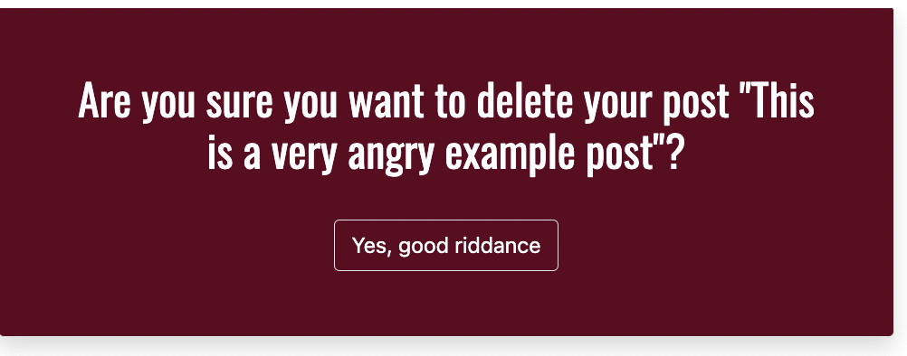

# Rageit

[View live project here](https://rageit.herokuapp.com/)

Welcome to RAGEit! The blog where you can rage freely and vent away your anger, frusturation, and sadness. The blog is completely anonymous as you do not need an email address to sign up, which allows you to vent with freedom. You can make posts, upload an image to your post, comment on other people's posts, and like posts ('rage' at posts, actually). So what are you waiting for? Release your anger!

## User Experience (UX)

### User Stories

- Users: 

    1. As a **user** I can **view posts on the main page with the excerpt** so that **I can quickly read which post seems interesting to me before clicking on it and reading further.**

    2. As a **user** I can **sign up easily with just a username and password** so that **I have the ability to create posts or comments without having to share my email address.**

    3. As a **user** I can **create posts** so that **I can share my own rage-worthy posts.**

    4. As a **user** I can **share photos in my posts** so that **I can add photographic evidence or add context to my rage-worthy posts.**

    5. As a **user** I can **make comments on posts** so that **I can share my thoughts on other people's rage-worthy posts.**

    6. As a **user** I can **revise my posts** so that **I can make any changes if needed.**

    7. As a **user** I can **delete my posts** so that **I have the freedom to remove any posts I no longer want to be shared.**

    8. As a **user** I can **delete my comments** so that **I have the freedom to remove any comments I no longer want to be shown.**

    9. As a **user** I can **easily log out** so that **I can have more security on my account.**

    10. As a **user** I can **easily log in** so that **I can quickly post or add more comments if I wish.**

    11. As a **user** I can **easily see how many posts or comments each post has in the homepage** so that **I can see which posts are popular or have the most comments if I wanted to read the most popular posts.**

    12. As a **user** I can **only edit and delete my own posts and view an error message if I tamper with the URL to edit or delete someone else's post** so that **I can have enhanced security and ensure no one tampers with my posts.**

    13. As a **user** I can **receive feedback immediately if I have uploaded an incorrect file or image type** so that **I can immediately know to fix my file or image before submitting a new or edited post or comment.**

    14. As a **User** I can **like posts or click again to unlike** so that **I can show my appreciation towards a post by liking, or change my mind and dislike later.**

- Site Admin: 

    1. As a **site admin** I can **review, create, and delete posts** so that **I can manage my website's main layout and content.**

    2. As a **site admin** I can **review, create, and delete comments on posts** so that **I can manage the comments and content on posts.**

### Data Model

- Data model has been created using the program Whimsical

    - This is the initial data model idea. While creating the project, decided not to include the comment features such as updated on and featured image. Comment also uses foreignkey for author/username so that users are able to delete their comments.

### Design

- Colour Scheme:

    1. Red (#5F021F)

    2. White

    3. Black

    - The main colours I have selected for this website are red (#5F021F), white, and black. I chose red because I wanted the colour to match the theme of the blog, which is all about rage. I wanted to keep the colours minimalistic so I have red (#5F021F) as the main colour, white font if the background is (#5F021F), and black font if the background is white. I used red (#5F021F) as the hover colour for the post titles (links) to keep to the red theme. The main posts have the red (#5F021F) background and white font. 

 - Typography

    1. Permanent Marker
    2. Oswald
    3. Sans Serif (fallback)

    - The main logo at the top left corner (h1) is written with the Permanent Marker font, and the rest of the text is used with Oswald, with sans serif as the fallback font. Permanent Marker is used for the aggressive-nature of the font which is to help highlight the theme of the blog. Oswald was used for it's easy readability and simplistic style.

### Wireframes

- Wireframes have been created using the program Whimsical

    - Mobile: 
        

    - Tablet: 
        

    - Desktop:
        

### Kanban Board

I used a kanban board to help organize the user stories and tasks required for this project. When each task was in progress, they would be dragged to the 'in progress' column. When they are completed, they would be dragged to the 'done' column. I also utilized MoSCoW prioritization by labelling each task as either Must Have or Should Have. I prioritized finishing the Must Have tasks first and then worked on the Should Have tasks. I managed to complete all of the tasks by the end. 

## Features

### Existing Features

- Logo and Navbar: 

For the h1 logo, I used the Permanent Marker font to help define the theme of the blog. When the user is not signed in, the navbar will show 'Login' and 'Sign Up' as options. When the user is signed in, the navbar will say 'hello' with the username beside it to confirm the username to the user. The navbar will also show an option to create a post, and to log out. The navbar links and logo are in red (#5F021F) to help show that they are clickable links, and the username name is in black to show that it is not clickable. When the navigation links are hovered, it will become white so the user receives feedback that the links are clickable. In smaller screens, the navbar will become a hamburger button that will become expandable when clicked. The navbar is fixed at the top so it will always remain at the top when the user scrolls down. This is added to enhance the user experience so that the user does not need to scroll all the way up when they want to access the navigation links. The navbar was created using Bootstrap 5. 

- Homepage: 

The homepage of the website shows a red banner that gives the user a brief introduction or explanation of the blog. In bigger screens, the posts are shown in columns of two and in smaller screens, one column for easy readability. The posts are shown with the featured image at the top, the post title in capital letters (to enhance the anger), a brief excerpt of the post (up to 200 characters), the username who made the post, the date when it was posted, and how many 'rages' and comments it has. The excerpt is there so the user can get a brief reading of the post before committing and clicking on the post to read further. The posts are ordered newest first so the users can get the latest rage posts. The post title is clickable (when hovered, becomes red (#5F021F)) which would take the user to the detailed view of the post. 

If the user is the author of the post, they are able to see 'edit' and 'delete'. This is there so the user can immediately see that they are the author of the post, and have quick and easy access to edit and delete the post from the homepage. 

The homepage also displays confirmation messages to the user as shown in these series of screenshots. The homepage displays messages such as when the user signs in, signs out, edits a post, or deletes a post. These messages are vital to communiate with the user when they perform a task to help confirm their task is completed or achieved. 

- Sign In/Login/Logout Pages:

Using Django's allauth, users are able to sign up, login, and logout easily. The allauth templates were edited to match the base template of RAGEit. These links are accessed via the navbar. When these links are clicked, it will take the user to a separate page for each option. The signup page contains an arrow which, when hovered, explains RAGEit's views on privacy and reasoning for email addresses to be optional. This function was created using basic JavaScript. When the user tries to log out, it will ask the user for confirmation before logging out the user. 

- Creating A Post:

When the user is logged in and clicks 'Create a New Post' in the navbar, the user will be directed to this page where they can create their post. Users can write the title of the post, the post content, and upload an image if they wish to. If the user uploads a file that is not jpeg, jpg, or png, the website will let the user know that the file is not accepted and will throw an error if the user proceeds with this file type. If the user does not select any photo, a placeholder image will be displayed instead which is of the crying angry meme man. 

- Detailed Post Views:

The detailed view of each post is accessible by clicking on the titles of the posts in the homepage. The slug feature of Django will direct the user to the specific url of each post, giving them the detailed view. When the user accesses the detailed view, the user will be able to see the full post content as well as the comments section. If there are no comments on the post, it will display the message 'it's lonely here'. If the user is NOT signed in, they will not see the textbox to be able to comment. If the user is signed in, they are able to leave a comment behind. 

In the comments section, users will be able to quickly identify their own comments from comments made by others as it will display the option to delete their comment. The comments will show the username of the commenter and the date the comment was made. When the user makes as comment, a message banner will show confirming that the comment is live. If the user wishes to delete their comment, they can click the 'delete comment' button which will redirect them to another page to confirm the deletion. Once the user confirms, the user will be redirected to the post and there will be a banner confirming the user's comment is deleted.

If the user has raged (reacted to) the post, they will be able to see, beside the rage / comment counter below the featured image, that they have already raged to the post. The user is able to rage and unrage the posts. When users rage/unrage posts, a message banner will pop up at the top to communicate with the user that their action is confirmed. The rage button will be circular to inform the user that the rage icon is indeed a button that can be clicked. When hovered, the rage icon will disappear to help confirm the user that it is clickable. Users can only rage to other people's posts. 

If any edits have been made to the post, there will be another paragraph shown below the creation date of when the edit was made. If no edit was made to the post, only the creation date will be shown.

When the user views their own post, users will be able to see the option to edit and delete post. The rage icon is no longer circular since the users are not able to react to their own posts. The rage button is not clickable here so therefore the rage icon is just a regular icon. 

- Editing A Post:

When users are editing their own posts (accessed via homepage or in detailed post view), they will be redirected to a new page. The form will already be prepopulated with the user's existing post, and users are able to make the changes they wish. If users do not select a new photo, the current photo will remain. If the user selects a new photo, the new photo will be used. 

- Deleting A Post:

When users try to delete their own posts (accessed via homepage or in detailed post view), they will be redirected to a new page. The page will ask for confirmation if the user wishes to go ahead with their deletion and shows the title of the post they wish to delete. The user then can confirm whether they want to delete or not. 

### Future Features

In the future, I wish to implement my original data model of the comments being revisable. As well, I wish for the comments to allow for featured photos too. I would also like for users to be able to insert videos or gifs to help get their angry messages across better.

## Technologies Used

### Languages and Packages/Libraries Used

### Frameworks, Libraries & Programs Used

1. [Git](https://git-scm.com/)
    - Git was used by utilizing the Gitpod terminal to commit to Git and Push to GitHub.

2. [GitHub](https://github.com/)
    - GitHub was used to store the project code after being pushed in by Git. Project repository linked with Heroku for deployment process. 

3. [Heroku](https://dashboard.heroku.com/login)
    - Heroku was used to deploy the Python project as a terminal based game after signing in with GitHub. 

4. [Whimsical](https://whimsical.com)
    - Whimsical was used to create the flowchart for the game. 

5. [PEP8 Online Check](http://pep8online.com/)
    - PEP8 Online Check was used to validate the Python code used and check for warnings/errors. 

6.  [Ecotrust-Canada Markdown-toc](https://ecotrust-canada.github.io/markdown-toc/)
    - Ecotrust-Canada Markdown was used to create the table of contents for this README. 

## Testing

### Bugs

## Deployment

- The following steps were taken for the deployment process:

    1. Ensure that the template used for the project is made with the Code Institute template linked above. 
    2. Second, in all Python scripts, ensure that input methods have a new line character at the end of the text inside.
    3. If any packages or installments were made, type in the following command in the terminal: **'pip3 freeze > requirements.txt'** so these installments / dependencies can work on Heroku. After typing this in, the requirements.txt file in the Code Institute Python template will automatically be updated. 
    4. Commit and push these changes onto GitHub.
    5. [Create an account for Heroku](https://id.heroku.com/login)
    6. On the Heroku dashboard, go to **Create new app**. 
    7. Name your app (must be a unique name) and select your region, and go to **Create app**.
    8. On the next page after selecting **Create app**, go to the **Settings** tab. Scroll down to **Config Vars** and select **Reveal Config Vars**.
    9. Since no APIs or Creds were used for Pirate Ship, the only Config Vars added was:
    Key: PORT / 
    Value: 8000
    10. Next, scroll down to **Buildpacks**. Click **Add Buildpack** and select **Python** and **Save Changes**. Next, add **nodejs** and **Save changes**. Ensure Python is on top and nodejs is below. 
    11. Next, scroll up and go to the **Deploy** tab.
    12. Under **Deployment method**, select **GitHub** and confirm **Connect to GitHub**. 
    13. Search for your repository name and click **Connect**.
    14. Scroll down and select **Deploy Branch** next to **Manual Deploy**. Ensure the branch to deploy is master/main. 
    15. Deployment gets created and live link is then previewed. 

## Credits

### Code

### Acknowledgements

