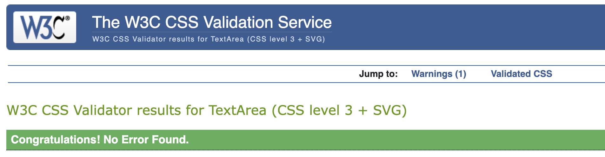
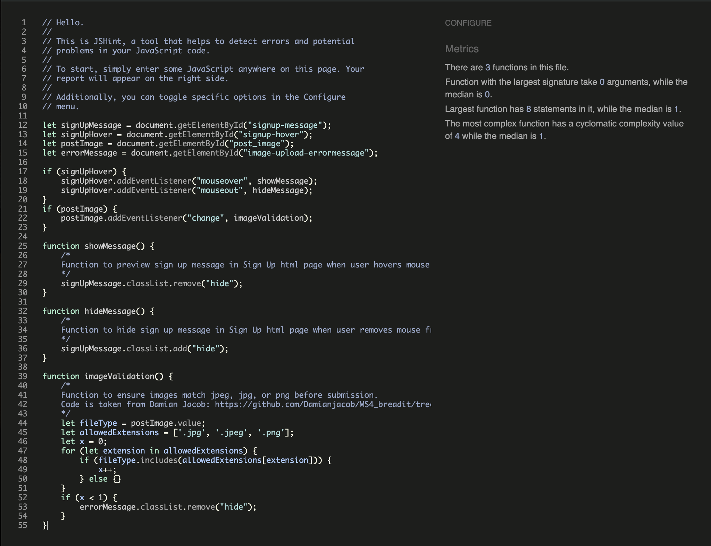
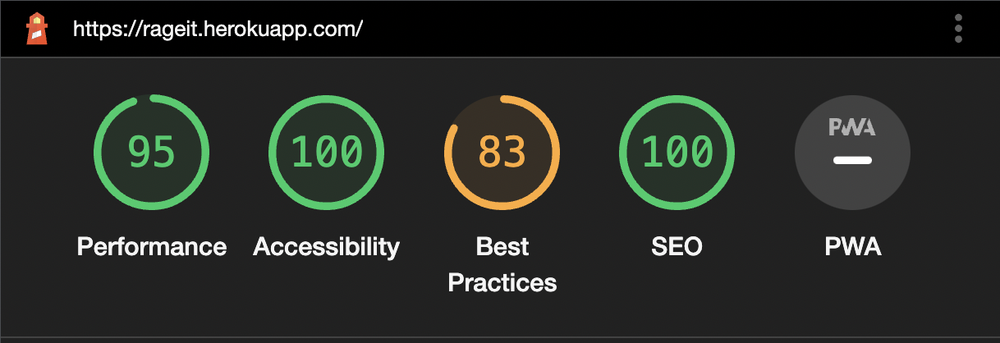

# Rageit

[View live project here](https://rageit.herokuapp.com/)

Welcome to RAGEit! The blog where you can rage freely and vent away your anger, frusturation, and sadness. The blog is completely anonymous as you do not need an email address to sign up, which allows you to vent with freedom. You can make posts, upload an image to your post, comment on other people's posts, and like posts ('rage' at posts, actually). So what are you waiting for? Release your anger!

## User Experience (UX)

### User Stories

- Users: 

    1. As a **user** I can **view posts on the main page with the excerpt** so that **I can quickly read which post seems interesting to me before clicking on it and reading further.**

    2. As a **user** I can **sign up easily with just a username and password** so that **I have the ability to create posts or comments without having to share my email address.**

    3. As a **user** I can **create posts** so that **I can share my own rage-worthy posts.**

    4. As a **user** I can **share photos in my posts** so that **I can add photographic evidence or add context to my rage-worthy posts.**

    5. As a **user** I can **make comments on posts** so that **I can share my thoughts on other people's rage-worthy posts.**

    6. As a **user** I can **revise my posts** so that **I can make any changes if needed.**

    7. As a **user** I can **delete my posts** so that **I have the freedom to remove any posts I no longer want to be shared.**

    8. As a **user** I can **delete my comments** so that **I have the freedom to remove any comments I no longer want to be shown.**

    9. As a **user** I can **easily log out** so that **I can have more security on my account.**

    10. As a **user** I can **easily log in** so that **I can quickly post or add more comments if I wish.**

    11. As a **user** I can **easily see how many posts or comments each post has in the homepage** so that **I can see which posts are popular or have the most comments if I wanted to read the most popular posts.**

    12. As a **user** I can **only edit and delete my own posts and view an error message if I tamper with the URL to edit or delete someone else's post** so that **I can have enhanced security and ensure no one tampers with my posts.**

    13. As a **user** I can **receive feedback immediately if I have uploaded an incorrect file or image type** so that **I can immediately know to fix my file or image before submitting a new or edited post or comment.**

    14. As a **User** I can **like posts or click again to unlike** so that **I can show my appreciation towards a post by liking, or change my mind and dislike later.**

- Site Admin: 

    1. As a **site admin** I can **review, create, and delete posts** so that **I can manage my website's main layout and content.**

    2. As a **site admin** I can **review, create, and delete comments on posts** so that **I can manage the comments and content on posts.**

### Data Model

- Data model has been created using the program Whimsical

    - This is the initial data model idea. While creating the project, decided not to include the comment features such as updated on and featured image. Comment also uses foreignkey for author/username so that users are able to delete their comments.

### Design

- Colour Scheme:

    1. Red (#5F021F)
    2. White
    3. Black

    - The main colours I have selected for this website are red (#5F021F), white, and black. I chose red because I wanted the colour to match the theme of the blog, which is all about rage. I wanted to keep the colours minimalistic so I have red (#5F021F) as the main colour, white font if the background is (#5F021F), and black font if the background is white. I used red (#5F021F) as the hover colour for the post titles (links) to keep to the red theme. The main posts have the red (#5F021F) background and white font. 

 - Typography

    1. Permanent Marker
    2. Oswald
    3. Sans Serif (fallback)

    - The main logo at the top left corner (h1) is written with the Permanent Marker font, and the rest of the text is used with Oswald, with sans serif as the fallback font. Permanent Marker is used for the aggressive-nature of the font which is to help highlight the theme of the blog. Oswald was used for it's easy readability and simplistic style.

### Wireframes

- Wireframes have been created using the program Whimsical

    - Mobile: 

    

    - Tablet: 

    

    - Desktop:

    

### Kanban Board

I used a kanban board to help organize the user stories and tasks required for this project. When each task was in progress, they would be dragged to the 'in progress' column. When they are completed, they would be dragged to the 'done' column. I also utilized MoSCoW prioritization by labelling each task as either Must Have or Should Have. I prioritized finishing the Must Have tasks first and then worked on the Should Have tasks. I managed to complete all of the tasks by the end. 

## Features

### Existing Features

### Logo and Navbar: 

For the h1 logo, I used the Permanent Marker font to help define the theme of the blog. When the user is not signed in, the navbar will show 'Login' and 'Sign Up' as options. When the user is signed in, the navbar will say 'hello' with the username beside it to confirm the username to the user. The navbar will also show an option to create a post, and to log out. The navbar links and logo are in red (#5F021F) to help show that they are clickable links, and the username name is in black to show that it is not clickable. When the navigation links are hovered, it will become white so the user receives feedback that the links are clickable. In smaller screens, the navbar will become a hamburger button that will become expandable when clicked. The navbar is fixed at the top so it will always remain at the top when the user scrolls down. This is added to enhance the user experience so that the user does not need to scroll all the way up when they want to access the navigation links.

User stories covered in Logo and Navbar:

- As a **user** I can **sign up easily with just a username and password** so that **I have the ability to create posts or comments without having to share my email address.**

- As a **user** I can **easily log out** so that **I can have more security on my account.**

- As a **user** I can **easily log in** so that **I can quickly post or add more comments if I wish.**

- As a **user** I can **create posts** so that **I can share my own rage-worthy posts.**

### Homepage: 

The homepage of the website shows a red banner that gives the user a brief introduction or explanation of the blog. In bigger screens, the posts are shown in columns of two and in smaller screens, one column for easy readability. The posts are shown with the featured image at the top, the post title in capital letters (to enhance the anger), a brief excerpt of the post (up to 200 characters), the username who made the post, the date when it was posted, and how many 'rages' and comments it has. The excerpt is there so the user can get a brief reading of the post before committing and clicking on the post to read further. The posts are ordered newest first so the users can get the latest rage posts. The post title is clickable (when hovered, becomes red (#5F021F)) which would take the user to the detailed view of the post. 

If the user is the author of the post, they are able to see 'edit' and 'delete'. This is there so the user can immediately see that they are the author of the post, and have quick and easy access to edit and delete the post from the homepage. 

The homepage also displays confirmation messages to the user as shown in these series of screenshots. The homepage displays messages such as when the user signs in, signs out, edits a post, or deletes a post. These messages are vital to communiate with the user when they perform a task to help confirm their task is completed or achieved. 

User stories covered in homepage:

- As a **user** I can **view posts on the main page with the excerpt** so that **I can quickly read which post seems interesting to me before clicking on it and reading further.**

- As a **user** I can **easily see how many posts or comments each post has in the homepage** so that **I can see which posts are popular or have the most comments if I wanted to read the most popular posts.**

- As a **user** I can **revise my posts** so that **I can make any changes if needed.**

- As a **user** I can **delete my posts** so that **I have the freedom to remove any posts I no longer want to be shared.**

### Sign Up/Login/Logout Pages:

Using Django's allauth, users are able to sign up, login, and logout easily. The allauth templates were edited to match the base template of RAGEit. These links are accessed via the navbar. When these links are clicked, it will take the user to a separate page for each option. The signup page contains an arrow which, when hovered, explains RAGEit's views on privacy and reasoning for email addresses to be optional. This function was created using basic JavaScript. When the user tries to log out, it will ask the user for confirmation before logging out the user. 

User stories covered in Sign Up/Login/Logout: 

- As a **user** I can **sign up easily with just a username and password** so that **I have the ability to create posts or comments without having to share my email address.**

- As a **user** I can **easily log out** so that **I can have more security on my account.**

- As a **user** I can **easily log in** so that **I can quickly post or add more comments if I wish.**

### Creating A Post:

When the user is logged in and clicks 'Create a New Post' in the navbar, the user will be directed to this page where they can create their post. Users can write the title of the post, the post content, and upload an image if they wish to. If the user uploads a file that is not jpeg, jpg, or png, the website will let the user know that the file is not accepted and will throw an error if the user proceeds with this file type. If the user does not select any photo, a placeholder image will be displayed instead which is of the crying angry meme man. 

User stories covered in Creating A Post:

- As a **user** I can **create posts** so that **I can share my own rage-worthy posts.**

- As a **user** I can **share photos in my posts** so that **I can add photographic evidence or add context to my rage-worthy posts.**

- As a **user** I can **receive feedback immediately if I have uploaded an incorrect file or image type** so that **I can immediately know to fix my file or image before submitting a new or edited post or comment.**

### Detailed Post Views:

The detailed view of each post is accessible by clicking on the titles of the posts in the homepage. The slug feature of Django will direct the user to the specific url of each post, giving them the detailed view. When the user accesses the detailed view, the user will be able to see the full post content as well as the comments section. If there are no comments on the post, it will display the message 'it's lonely here'. If the user is NOT signed in, they will not see the textbox to be able to comment. If the user is signed in, they are able to leave a comment behind. 

In the comments section, users will be able to quickly identify their own comments from comments made by others as it will display the option to delete their comment. The comments will show the username of the commenter and the date the comment was made. When the user makes as comment, a message banner will show confirming that the comment is live. If the user wishes to delete their comment, they can click the 'delete comment' button which will redirect them to another page to confirm the deletion. Once the user confirms, the user will be redirected to the post and there will be a banner confirming the user's comment is deleted.

If the user has raged (reacted to) the post, they will be able to see, beside the rage / comment counter below the featured image, that they have already raged to the post. The user is able to rage and unrage the posts. When users rage/unrage posts, a message banner will pop up at the top to communicate with the user that their action is confirmed. The rage button will be circular to inform the user that the rage icon is indeed a button that can be clicked. When hovered, the rage icon will disappear to help confirm the user that it is clickable. Users can only rage to other people's posts. 

If any edits have been made to the post, there will be another paragraph shown below the creation date of when the edit was made. If no edit was made to the post, only the creation date will be shown.

When the user views their own post, users will be able to see the option to edit and delete post. The rage icon is no longer circular since the users are not able to react to their own posts. The rage button is not clickable here so therefore the rage icon is just a regular icon. 

User stories covered in Detailed Post Views:

- As a **user** I can **make comments on posts** so that **I can share my thoughts on other people's rage-worthy posts.**

- As a **user** I can **revise my posts** so that **I can make any changes if needed.**

- As a **user** I can **delete my posts** so that **I have the freedom to remove any posts I no longer want to be shared.**

- As a **user** I can **delete my comments** so that **I have the freedom to remove any comments I no longer want to be shown.**

- As a **User** I can **like posts or click again to unlike** so that **I can show my appreciation towards a post by liking, or change my mind and dislike later.**

### Editing A Post:

When users are editing their own posts (accessed via homepage or in detailed post view), they will be redirected to a new page. The form will already be prepopulated with the user's existing post, and users are able to make the changes they wish. If users do not select a new photo, the current photo will remain. If the user does not upload a file that is jpeg, jpg, or png, it will show the same error message warning the user not to proceed with the file or else an error will be shown. If the user selects a new photo, the new photo will be used. If user who is NOT the author tries to access the url page to edit, it will throw an error that the user is forbidden to enter, to protect the author's posts. 

User stores covered in Editing A Post:

- As a **user** I can **revise my posts** so that **I can make any changes if needed.**

- As a **user** I can **only edit and delete my own posts and view an error message if I tamper with the URL to edit or delete someone else's post** so that **I can have enhanced security and ensure no one tampers with my posts.**

- As a **user** I can **receive feedback immediately if I have uploaded an incorrect file or image type** so that **I can immediately know to fix my file or image before submitting a new or edited post or comment.**

### Deleting A Post:

When users try to delete their own posts (accessed via homepage or in detailed post view), they will be redirected to a new page. The page will ask for confirmation if the user wishes to go ahead with their deletion and shows the title of the post they wish to delete. The user then can confirm whether they want to delete or not. If user who is NOT the author tries to access the url page to delete, it will throw an error that the user is forbidden to enter, to protect the author's posts.

User stories covered in Deleting A Post:

- As a **user** I can **delete my posts** so that **I have the freedom to remove any posts I no longer want to be shared.**

- As a **user** I can **only edit and delete my own posts and view an error message if I tamper with the URL to edit or delete someone else's post** so that **I can have enhanced security and ensure no one tampers with my posts.**

### Admin:

Superuser was created for this blog for the admin to be able to review, create, and delete posts in the admin page with ease. The admin is in charge of all of the posts and is able to delete any posts desired to ensure the blog is appropriate and has the layout maintained. The admin also has access to the comments and is able to review, create, and delete comments to keep the comments section consistent and appropriate. 

User stories covered in Admin:

- As a **site admin** I can **review, create, and delete posts** so that **I can manage my website's main layout and content.**

- As a **site admin** I can **review, create, and delete comments on posts** so that **I can manage the comments and content on posts.**

### Future Features

In the future, I wish to implement my original data model of the comments being revisable. As well, I wish for the comments to allow for featured photos too. I would also like for users to be able to insert videos or gifs to help get their angry messages across better.

## Technologies Used

This project was made primarily with Django.

### Languages and Packages/Libraries Used

1. [Django](https://www.djangoproject.com/)

2. [Python](https://www.python.org/)

3. [HTML5](https://en.wikipedia.org/wiki/HTML5)

4. [CSS3](https://en.wikipedia.org/wiki/CSS)

5. [JavaScript](https://www.javascript.com/)

6. [psycopg2](https://pypi.org/project/psycopg2/)

7. [Django allauth](https://django-allauth.readthedocs.io/en/latest/installation.html)

8. [Bootstrap 5](https://getbootstrap.com/docs/5.0/getting-started/introduction/)

9. [gunicorn](https://gunicorn.org/)

10. [PostgreSQL](https://www.postgresql.org/)

### Programs Used

1. [Git](https://git-scm.com/)
    - Git was used by utilizing the Gitpod terminal to commit to Git and Push to GitHub.

2. [GitHub](https://github.com/)
    - GitHub was used to store the project code after being pushed in by Git. Project repository linked with Heroku for deployment process. GitHub was also used to create the kanban board. 

3. [Heroku](https://dashboard.heroku.com/login)
    - Heroku was used to deploy the Python project as a terminal based game after signing in with GitHub. 

4. [Whimsical](https://whimsical.com)
    - Whimsical was used to create the data model and the wireframes for the project. 

5. [PEP8 Online Check](http://pep8online.com/)
    - PEP8 Online Check was used to validate the Python code used and check for warnings/errors. 

6. [Ecotrust-Canada Markdown-toc](https://ecotrust-canada.github.io/markdown-toc/)
    - Ecotrust-Canada Markdown was used to create the table of contents for this README. 

7. [W3C Validator](https://validator.w3.org/)
    - W3C validator used to check the HTML5 code.

8. [W3C CSS Validator](https://jigsaw.w3.org/css-validator/)
    - W3C CSS validator used to check the CSS3 code.

9. [JSHint](https://jshint.com/)
    - JSHint used to check the JavaScript code. 

10. [Cloudinary](https://cloudinary.com/)
    - Cloudinary used to host the uploaded images.

11. [Font Awesome](https://fontawesome.com/)
    - Font Awesome was used for icons

12. [Google Fonts](https://fonts.google.com/)
    - Google Fonts was used for the Permanent Marker and Oswald fonts. 

13. [Favicon.io](https://favicon.io/)
    - Favicon.io was used for the favicon.

14. [autopep8](https://pypi.org/project/autopep8/)
    - Autopep8 was used to help organize Python code to match pep8 standards.

15. Beautify
    - Beautify Command Palette on Git was used to organize the code in all files.

16. [Coolors](https://coolors.co/)
    - Coolors was used to get the specific red (#5F021F) colour used in the project. 

## Testing

### Validation Testing & Lighthouse

- HTML Validation (W3C HTML):

    All passed with no errors.

    

    
Screenshot of HTML Validation: Homepage

    
    

    

    
Screenshot of HTML Validation: Create Post

    
    

    

    
Screenshot of HTML Validation: Detailed Post

    
    

    

    
Screenshot of HTML Validation: Logout

    
    

    

    
Screenshot of HTML Validation: Signup

    
    

    

    
Screenshot of HTML Validation: Login

    
    

    

    
Screenshot of HTML Validation: Update Post

    
    

    

    
Screenshot of HTML Validation: Delete Post

    
    

    

    
Screenshot of HTML Validation: Delete Comment

    
    

- CSS Validation (W3C CSS):

    Passed with no errors.

    

    
Screenshot of CSS validation

    
    

- JavaScript Validation (JSHint):

    Passed with no errors.

    

    
Screenshot of JavaScript validation

    
    

- Python Validation (PEP8): 

    The settings.py file has not gone through the PEP8 validation due to the fragile and delicate nature of the file. Any unwanted tampering or modifications may break the project. Therefore, only the other Python files have been checked and validated.  

    

    
Screenshot of Python Validation: Admin

    
    

    

    
Screenshot of Python Validation: Apps

    
    

    

    
Screenshot of Python Validation: Forms

    
    

    

    
Screenshot of Python Validation: Models

    
    

    

    
Screenshot of Python Validation: Urls

    
    

    

    
Screenshot of Python Validation: Views

    
    

    

    
Screenshot of Python Validation: Rageit/Urls

    
    

- Lighthouse

    

    
Screenshot of Lighthouse Score: Homepage

    
    

    

    
Screenshot of Lighthouse Score: Homepage Best Practices

    
    

    The homepage scored 83 for best practices. When looking into the score further, it seems to be due to low image resolution. These images appear to be from the user's featured images. Therefore, if the user uploads low-resolution photos, then the Lighthouse score will be lower.

    

    
Screenshot of Lighthouse Score: Detailed View

    
    

    

    
Screenshot of Lighthouse Score: Create Post

    
    

    

    
Screenshot of Lighthouse Score: Logout

    
    

    

    
Screenshot of Lighthouse Score: Update Post

    
    

    

    
Screenshot of Lighthouse Score: Delete Post

    
    

    

    
Screenshot of Lighthouse Score: Login

    
    

    

    
Screenshot of Lighthouse Score: Signup

    
    

    

    
Screenshot of Lighthouse Score: Comment Delete

    
    

### Manual Testing

The project has been tested heavily via manual testing. The website has been tested using Google DevTools > Inspect, with all of the different devices listed. All pages are responsive to all listed devices, even the Galaxy Fold! The website has been tested on MacBook 2022, MacBook 2020, iMac 2019, iPhone 13 Mini, iPhone 11, iPad Pro, OnePlus, and ASUS ROG. Multiple friends have tested out this website, raging about their own personal issues. I tested this out myself by creating many different accounts, making many posts, reacting to my posts, unreacting, ensuring that all respective messages are shown when unraged/raged/commented/comment deleted. I have created and deleted many posts and many comments to ensure everything is deleted properly. I made posts and comments with very long string of text to ensure that all characters and text will remain within the container. I have tried tampering with the url to access edit_post and delete_post of a post made by a different author under a different user name and successfully reached the error page (however, this feature is not available for deleting comments). I have tried uploading a non jpeg/jpg/png file to create_post and edit_post and successfully tested the JavaScript message to show up. Lots of testing has been done to ensure the website works properley, and the code have been validated through respective validators. 

### Bugs

Many bugs have been encountered while creating this project.

- When running the JS file through JSHint the first time, there was an error for imageValidation being an unused variable. This was due to the function being called in the HTML file as 'onchange="imageValidation"'. In order to bypass this, I would remove the function from being called in HTML and create an addEventListener in JS. However, there were issues with my other eventListeners in my JS file. In my create_post.html, when trying to run the imageValidation function, the console would state that there was an error for my other eventListeners since there are no variables or properties matching signUpMessage and signUpHover (these would be available in the signup html page instead). After researching on Stack Overflow and speaking with Tutor Support, I created an if statement to check if these variables exist. The error disappeared and the imageValidation function now runs perfectly.

- In the post_detailed_view.html page, I was trying to create an if else statement to display a paragraph to the user if there are no comments posted on the post. I wanted the paragraph to say "it's lonely here" if there are no comments, and to show the comments if there are comments. I was not able to get the if else statement correct, and it kept stating that there were no comments. After speaking with my mentor, I have incorrectly formatted my if else statement and he has guided me on the correct syntax.

- A big bug I ran into was trying to show the revised date of the post ONLY when a revision is made. In post_detailed_view.html, I wanted the post creation date to show up. If the user did NOT make an edit, I ONLY wanted the creation date to show. If the user made an edit, THEN it would show that the post was edited. I tried to create a if_revised function in views.py to check to see if creation date does not match revised date, for it to prove true that the post was indeed revised. However, in the html page, it would always show the revised dates, regardless if it was revised or not. I talked to Tutor Support, and it turns out that revised date and created date are in milliseconds so it will always show that they do not equal. I asked my mentor for support and he suggested to use a time delta to check the difference between created date and revised date. Using time delta to 1 second, I managed to get this feature added successfully. 

- When deploying, I was running into failed deploy errors on Heroku. It turns out that I had downloaded crispy-forms and had it in my installed apps in settings.py, but actually have never used crispy-forms anywhere. I ended up having to uninstall crispy-forms and remove it from installed apps and the deployment worked successfully.

- I ran into complications with using author as a foreignkey in my models.py Comment class. This is where my Django knowledge really had to be tested when creating ways to show the author of comments in the HTML, and how to delete comments. I received a lot of help from Tutor Support on creating the comment delete views.py function, by suggesting me to use DeleteView. Tutor Support and I worked together to solve how to redirect the user back to the post_detailed_view of the specific post that they were commenting on, after the comment is deleted.

- When first testing out the project after deploying, I noticed that the text would go over the container if the title or comments were very long strings. I managed to fix this by adding the Bootstrap class text-break. 

## Deployment

- The following steps were taken for the deployment process (taken from the I Think Therefore I Blog project):

    **Project creation and initial deplyoment**
    1. Ensure that the template used for the project is made with the Code Institute template linked [here](https://github.com/Code-Institute-Org/gitpod-full-template). 
    2. Using pip3, install **[Django gunicorn](https://www.djangoproject.com/)**
    3. Using pip3, install **dj_database_url psycopg2**
    4. Using pip3, install **dj3-cloudinary-storage**
    5. Run **pip3 freeze --local > requirements.txt** so installments /dependencies can work on Heroku.
    6. Create Django project using **django-admin startproject** on terminal
    7. Create Django app using **python3 manage.py startapp** on terminal
    8. In settings.py, add installed the app under **INSTALLED_APPS**
    9. Any changes in database (changing models, creating a new app), run migrations to the database using the command **python3 manage.py makemigrations** and then **python3 manage.py migrate**
    10. [Create an account for Heroku](https://id.heroku.com/login)
    11. On the Heroku dashboard, go to **Create new app**, give it a name and select region and submit.
    12. On Heroku, under **Resources**, search up **Postgres** in **Add-ons** and select **Heroku Postgres**.
    13. On Heroku, under the **Settings** tab, click on **Reveal Config vars**, copy the **DATABASE_URL**. 
    14. In Gitpod, create a file called **env.py** (should already be in git ignore file in template used). Import os, and set up the **DATABASE_URL** environment variable where the Heroku **DATABASE_URL** will be pasted. 
    15. In **env.py**, also create another environment variable for **SECRET_KEY** and create your secret key. Copy the **SECRET_KEY** value.
    16. In Heroku, in **Config vars**, create a new **Config var** for **SECRET_KEY** and paste your secret key and click add. 
    16. In Gitpod, go to **settings.py** and import os. Import **dj_database_url** and create if statement to check if **env.py** is a file, to import **env**.
    17. In **SECRET_KEY** section in **settings.py**, import os.environ **SECRET_KEY**.
    18. In **settings.py**, comment out the **DATABASES** and add in **DATABASES** to add **dj_database_url** from **env.py** file. 
    19. In Heroku, add another **Config var**, KEY: PORT/ Value: 8000
    20. Create a [Cloudinary account](https://cloudinary.com/). Copy the **API Environemnt variable**
    21. In Gitpod, in **env.py**, add in the **CLOUDINARY_URL** and paste the **API Environment variable**.
    22. In Heroku, create another **Config var** for **CLOUDINARY_URL** and paste in the value from **API Environment variable**
    23. In Heroku, add another key for **DISABLE_COLLECTSTATIC** and set it to **1** since there are no static files currently. 
    24. In **settings.py**, add in Cloudinary libraries under **INSTALLED_APPS**
    25. In **settings.py**, add in **STATICFILES_STORAGE** to install Cloudinary further. Also set up **STATICFILES_DIRS** to connect to static. Create **MEDIA_URL** for **/media/** and set **DEFAULT_FILE_STORAGE** for Cloudinary media storage. 
    26. At the top of **settings.py**, create **TEMPLATES_DIR** to join base directory and templates.
    27. In **settings.py**, set **DIRS** in **TEMPLATES** to match **DIRS** to **TEMPALTE_DIR**.
    28. In **settings.py**, add your Heroku app name followed by herokuapp.com in **ALLOWED_HOSTS**, as well as **localhost**.
    29. In Gitpod, create **media**, **static**, and **templates** folders. 
    30. In Gitpod, create a **Procfile**. Type in **web: gunicorn [projectname].wsgi**
    31. Commit and push these changes onto GitHub.
    32. In Heroku, under the **deploy** tab, choose **GitHub** as deployment method, login to GitHub, and search for your project repo. Click **manual deploy** (or **automatic deploy** if you want GitHub pushes to deploy to Heroku each time)
    33. When deployment is successful, click **open app** to see your deployment. 
    **Final deplyoment**
    34. In **settings.py**, ensure **DEBUG** is **False** !!!!!!
    35. In **settings.py**, create the setting **X_FRAME_OPTIONS** and set to **SAMEORIGIN**.
    36. Commit and push these changes onto GitHub.
    37. In Heroku, in **Reveal Config Vars**, remove **DISABLE_COLLECTSTATIC** variable. Under **Deploy**, scroll down to bottom and deploy branch. 

- The following steps were taken for the cloning process: 

  1. Log in to **[GitHub](https://github.com/)**.
  2. Click on the profile icon to locate **'Your repositories'**. 
  3. On the repository page, click on the repository you wish to clone.
  4. Under **'Code'**, see the different cloning options, HTTPS, SSH, and GitHub CLI. Click the prefered cloning option, and then copy the link provided. 
  5. Open **Terminal**.
  6. In Terminal, change the current working directory to the desired location of the cloned directory.
  7. Type git clone, and then paste the URL copied from GitHub earlier. 
  8. Type **Enter** to create the local clone. 

## Credits

### Code

- [Stack Overflow](https://stackoverflow.com/)
    - Stack Overflow was referred to many many times for help on certain code and implementing features, such as understanding the class-based views.py, creating JavaScript functions, Django messages, overwriting Bootstrap 5 code with CSS, etc.

- [MDN Web Docs](https://developer.mozilla.org/en-US/)
    - MDN Web Docs was referred to many times on general Django instructions.

- Code Institute - I Think Therefore I Blog project
    - The 'I Think Therefore I Blog' project was referred to many times on Django models, Django views, Django urls, the function to like and unlike posts, creating my HTML templates, and the idea of using Django's allauth for signing up, logging in, and logging out. The project was also referred to for the deployment process and how to install Cloudinary. 

- [Damian Jacob](https://github.com/damianjacob)
    - Damian Jacob has helped me a lot with this project. His codes for the Django views URL validation and JavaScript file validation were used and cited. 

- [Learn Django](https://learndjango.com/tutorials/django-slug-tutorial)
    - This website was referred to when using Django's slug feature. Slug function codes were copied from this website and inserted into the models.py file. The codes are cited in models.py.

- [freeCodeCamp.org YouTube](https://www.youtube.com/watch?v=F5mRW0jo-U4&ab_channel=freeCodeCamp.org)
    - This YouTube video uploaded by freeCodeCamp.org was referred to many times.

- [GeeksforGeeks](https://www.geeksforgeeks.org/)
    - This website was referred to many times when creating views.py file. This website was extremely helpful with detailed view, create view, delete view, and update view. 

- [Django Documentation](https://www.djangoproject.com/)
    - The official Django documentation was referred to many times while creating this project. 

- Code Institute Tutor Support
    - Tutor support helped me a lot with the project. Specifically, how to delete comments and redirect the user back to the detailed view of individual posts. Tutor Support was a massive help during this project, cannot thank them enough. 

### Acknowledgements

Big thank you to my mentor for all of his support and help. Also really appreciate the Code Institute Slack channel for always being available and being super friendly helping me with my questions! Thank you to fellow Code Institute students such as Ian Meigh for testing my project and providing support throughout the development process. Most of all, massive thank you to Code Institute Tutor Support for helping me A LOT during this project!

